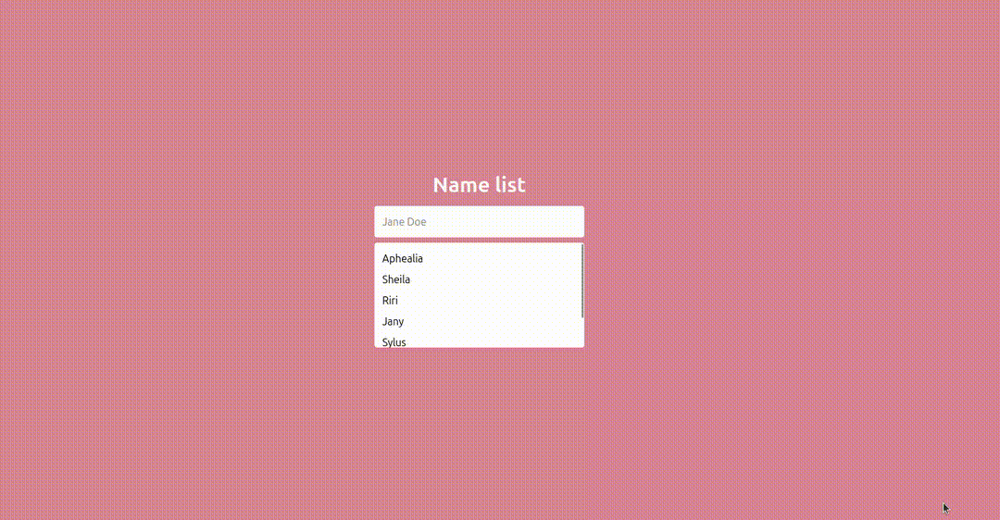
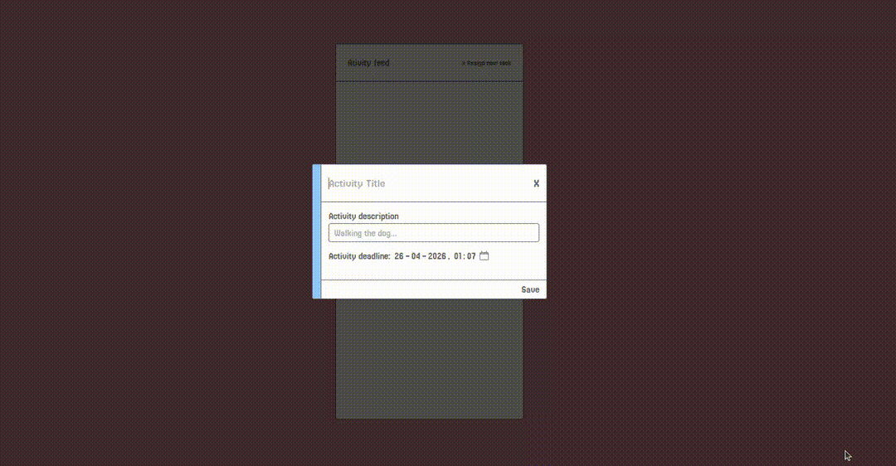

# REMINDER

This application was created to refresh my knowledge of Laravel and Livewire, frameworks I worked with extensively in the past.

## Commands

To run the project\
`composer run dev`

To create the database tables\
`php artisan migrate`

## Features

**Current features that have been built into this application:**

- Searchbar
- Activity feed
- Registration

### Searchbar

**Current features:**

- Shows names matching to input
  `NOTE: CURRENTLY RETRIEVED WITH JSON, WILL BE QUERY BASED IN THE FUTURE`

**Demo**

### Activity

**Current features:**

- Create a new activity
- Delete an existing activity
- Showing all the activities

**Future implementations:**

- Editing activity
- Count down to activity dead-line
- Adding color to activity
- Pop-up reminder of scheduled activity

**Demo**

### Registration

**Current features:**

- Create a new user
- Validating input
- Test scripts

**Future implementations:**

- Route to user page instead of activity
